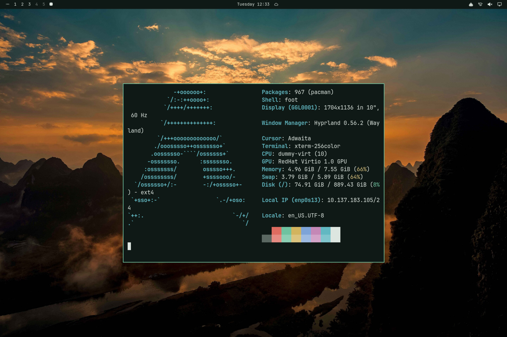

# 桂林·夜 Guilin Night

漓江夜色为底、晨雾白为字、碧水青为印的深色主题。壁纸：漓江与阳朔峰林的日落暮色。



## 安装

```bash
omarchy theme install https://github.com/rwanglq-ctrl/omarchy-guilin-night-theme
```

## 壁纸来源

1. [Li River (43871411004).jpg](https://commons.wikimedia.org/wiki/File:Li_River_%2843871411004%29.jpg) — Rod Waddington，CC BY-SA 2.0（Wikimedia Commons）；已裁切、缩放
2. [Cormorant Fisherman on the Li River.jpg](https://commons.wikimedia.org/wiki/File:Cormorant_Fisherman_on_the_Li_River.jpg) — Rod Waddington，CC BY-SA 2.0（Wikimedia Commons）；已裁切、缩放
3. [阳朔峰林日落](https://unsplash.com/photos/sunset-over-a-city-surrounded-by-numerous-karst-mountains-__sP4dDE0_4) — Caleb Jack，Unsplash License（Unsplash）
4. [漓江暮色](https://unsplash.com/photos/people-on-beach-during-sunset-ziAIutI-PDA) — dave cadwell，Unsplash License（Unsplash）

## 许可

- 壁纸：Wikimedia Commons 照片按各自 CC 许可署名，改编版以 CC BY-SA 4.0 提供；Unsplash 照片依 Unsplash License 使用
- 配色与配置文件：MIT

详见 [LICENSE](LICENSE)。
